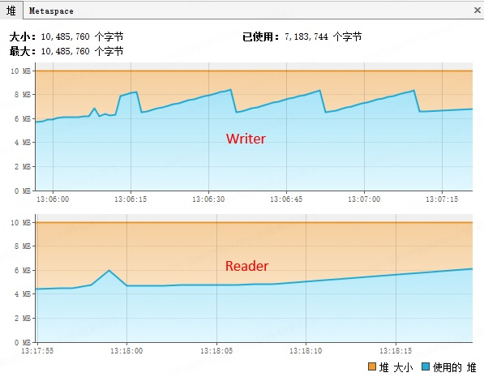
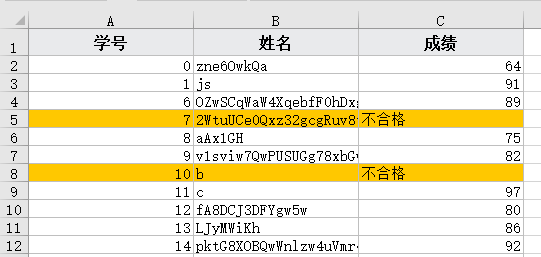
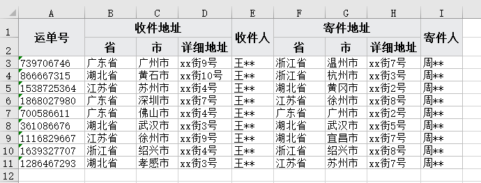
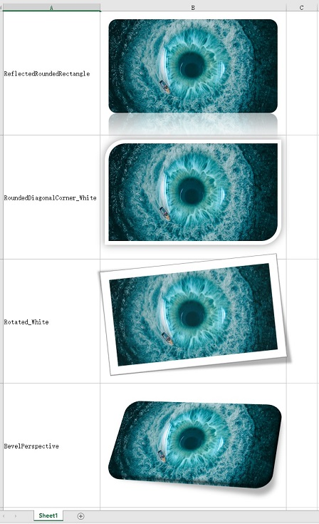

# EEC介绍

[![Release][release-image]][releases] [![License][license-image]][license]

EEC（Excel Export Core）是一款轻量且高效的Excel读写工具，它具有包体小、接入代码量少和运行时消耗资源少三个特点

EEC的设计初衷是为了解决Apache POI内存高、速度慢且API臃肿的诟病。EEC的底层并不依赖POI包，所有的底层代码均自己实现，事实上EEC仅依赖`dom4j`和`slf4j`，前者用于小文件xml读取，后者统一日志接口。

EEC在JVM参数`-Xmx10m -Xms10m`下读写100w行x29列内存使用截图，下载 [eec-benchmark](https://github.com/wangguanquan/eec-benchmark) 项目进行性能测试



## 现状

EEC支持大多数日常应用场景，最擅长的是表格处理，比如转对象数组、转Map数组、内容检查等导入/导出常见功能。

目前已实现worksheet类型有六种，也可以继承已有[Worksheet](./src/main/java/org/ttzero/excel/entity/Sheet.java)来实现自定义数据源

- [ListSheet](./src/main/java/org/ttzero/excel/entity/ListSheet.java) // 对象数组
- [ListMapSheet](./src/main/java/org/ttzero/excel/entity/ListMapSheet.java) // Map数组
- [StatementSheet](./src/main/java/org/ttzero/excel/entity/StatementSheet.java) // PreparedStatement
- [ResultSetSheet](./src/main/java/org/ttzero/excel/entity/ResultSetSheet.java) // ResultSet支持(多用于存储过程)
- [EmptySheet](./src/main/java/org/ttzero/excel/entity/EmptySheet.java) // 空worksheet
- [CSVSheet](./src/main/java/org/ttzero/excel/entity/CSVSheet.java) // 支持csv与xlsx互转

## WIKI

阅读[WIKI](https://github.com/wangguanquan/eec/wiki) 了解更多用法


## 主要功能

1. 支持**大数据量导出**，行数无上限，超过单个Sheet上限会自动分页
2. **超低内存**，无论是xlsx还是xls格式，大部分情况下可以在10MB以内完成十万级甚至百万级行数据读写
3. 支持动态样式，如导出库存时将低于预警阈值的行背景标黄显示
4. 支持一键设置斑马线，利于阅读
5. **自适应列宽对中文更精准**
6. 采用Stream流读文件，按需加载不会将整个文件读入到内存
7. 支持iterator和stream+lambda读文件，你可以像操作集合类一样操作Excel
8. 支持csv与excel格式相互转换

## 使用方法

pom.xml添加

```xml
<dependency>
    <groupId>org.ttzero</groupId>
    <artifactId>eec</artifactId>
    <version>${eec.version}</version>
</dependency>
```

## 示例

#### 1. 简单导出
对象数组导出时可以在对象上使用注解`@ExcelColumn("列名")`来设置excel头部信息

```java
@ExcelColumn("渠道ID")
private int channelId;

@ExcelColumn
private String account;
```

默认情况下导出的列顺序与字段在对象中的定义顺序一致，可以设置`colIndex`或者指定Column数组。

```java
// 创建一个名为"test object"的excel文件
new Workbook("test object")

    // 添加一个worksheet，可以通过addSheet添加多个worksheet
    .addSheet(new ListSheet<>("学生信息", students))

    // 指定输出位置，如果做文件导出可以直接输出到`respone.getOutputStream()`
    .writeTo(Paths.get("f:/excel"));
```

#### 2. 动态样式

动态样式和数据转换是使用`@FunctionalInterface`实现，也可以使用`StyleDesign`注解，下面展示如何将低下60分的成绩输出为"不合格"并将整行标为橙色

```java
new Workbook("2021小五班期未考试成绩")
    .addSheet(new ListSheet<>("期末成绩", students
         , new Column("学号", "id", int.class)
         , new Column("姓名", "name", String.class)
         , new Column("成绩", "score", int.class, n -> (int) n < 60 ? "不合格" : n)
    ).setStyleProcessor((o, style, sst) -> 
            o.getScore() < 60 ? Styles.clearFill(style) | sst.addFill(new Fill(PatternType.solid, Color.orange)) : style)
    ).writeTo(Paths.get("f:/excel"));
```

效果如下图



#### 3. 自适应列宽更精准

```java
// 测试类
public static class WidthTestItem {
    @ExcelColumn(value = "整型", format = "#,##0_);[Red]-#,##0_);0_)")
    private Integer nv;
    @ExcelColumn("字符串(en)")
    private String sen;
    @ExcelColumn("字符串(中文)")
    private String scn;
    @ExcelColumn(value = "日期时间", format = "yyyy-mm-dd hh:mm:ss")
    private Timestamp iv;
}

new Workbook("Auto Width Test")
    .setAutoSize(true) // 自动列宽
    .addSheet(new ListSheet<>(randomTestData()))
    .writeTo(Paths.get("f:/excel"));
```


#### 4. 支持多行表头

EEC使用多个ExcelColumn注解来实现多级表头，名称一样的行或列将自动合并

```java
 public static class RepeatableEntry {
    @ExcelColumn("运单号")
    private String orderNo;
    @ExcelColumn("收件地址")
    @ExcelColumn("省")
    private String rProvince;
    @ExcelColumn("收件地址")
    @ExcelColumn("市")
    private String rCity;
    @ExcelColumn("收件地址")
    @ExcelColumn("详细地址")
    private String rDetail;
    @ExcelColumn("收件人")
    private String recipient;
    @ExcelColumn("寄件地址")
    @ExcelColumn("省")
    private String sProvince;
    @ExcelColumn("寄件地址")
    @ExcelColumn("市")
    private String sCity;
    @ExcelColumn("寄件地址")
    @ExcelColumn("详细地址")
    private String sDetail;
    @ExcelColumn("寄件人")
    private String sender;
}
```


#### 5. 报表轻松制作

现在使用普通的ListSheet就可以导出漂亮的报表。示例请跳转到 [WIKI](https://github.com/wangguanquan/eec/wiki/%E6%8A%A5%E8%A1%A8%E7%B1%BB%E5%AF%BC%E5%87%BA%E6%A0%B7%E5%BC%8F%E7%A4%BA%E4%BE%8B)

记帐类


统计类


#### 6. 支持28种预设图片样式

关于图片样式请参考[1-导出Excel#导出图片](https://github.com/wangguanquan/eec/wiki/1-%E5%AF%BC%E5%87%BAExcel#%E5%AF%BC%E5%87%BA%E5%9B%BE%E7%89%87)



### 读取示例

EEC使用`ExcelReader#read`静态方法读文件，下面展示一些常规的读取方法

#### 1. 使用stream

```java
try (ExcelReader reader = ExcelReader.read(Paths.get("./用户注册.xlsx"))) {
    // 读取所有worksheet并输出
    reader.sheets().flatMap(Sheet::rows).forEach(System.out::println);
} catch (IOException e) {
    e.printStackTrace();
}
```

#### 2. 读入到数组或List中

```java
try (ExcelReader reader = ExcelReader.read(Paths.get("./User.xlsx"))) {
    // 读取第1个Sheet页
    List<User> users = reader.sheet(0)
        // 指定第6为表头，前5行为概要信息
        .header(6)
        // 读取数据行
        .rows()
        // 将每行数据转换为User象
        .map(row -> row.to(User.class))
        // 收集为List或数组进行后续处理
        .collect(Collectors.toList());
} catch (IOException e) {
    e.printStackTrace();
}
```

#### 3. 过滤和聚合

EEC支持Stream的大部分功能，以下代码展示过滤平台为"iOS"的注册用户

```java
reader.sheet(0)
    .dataRows()
    .filter(row -> "iOS".equals(row.getString("platform"))) // 过滤平台为"iOS"的数据
    .map(row -> row.to(Regist.class))
    .collect(Collectors.toList());
```

#### 4. 多表头读取

多级表头读取时可以使用`header`方法来指定表头所在的行号

```java
reader.sheet(0)
    .header(1, 2) // 指定表头所在的行第1行和第二行均为表头
    .map(Row::toMap) // Row 转 Map
    .forEach(System.out::println)
```

更多关于多表头使用方法可以参考 [WIKI](https://github.com/wangguanquan/eec/wiki/%E5%A6%82%E4%BD%95%E8%AE%BE%E7%BD%AE%E5%A4%9A%E8%A1%8C%E8%A1%A8%E5%A4%B4#%E8%AF%BB%E5%8F%96%E5%B8%A6%E5%A4%9A%E8%A1%8C%E8%A1%A8%E5%A4%B4%E7%9A%84%E6%96%87%E4%BB%B6)

### xls格式支持

pom.xml添加如下依赖，添加好后即完成了xls的兼容，是的你不需要为xls写任何一行代码。

```xml
<dependency>
    <groupId>org.ttzero</groupId>
    <artifactId>eec-e3-support</artifactId>
    <version>${eec-e3-support.version}</version>
</dependency>
```

读取xls格式的方法与读取xlsx格式完全一样，读取文件时不需要判断是xls格式还是xlsx格式，EEC为其提供了完全一样的接口，内部会根据文件头去判断具体类型， 这种方式比判断文件后缀准确得多。

两个工具的兼容性 [参考此表](https://github.com/wangguanquan/eec/wiki/EEC%E4%B8%8EE3-support%E5%85%BC%E5%AE%B9%E6%80%A7%E5%AF%B9%E7%85%A7%E8%A1%A8)

### CSV与Excel格式互转

- CSV => Excel：向Workbook中添加一个`CSVSheet`
- Excel => CSV：读Excel时调用`saveAsCSV`

代码示例

```java
// 直接保存为csv生成测试文件，对于数据量较多的场合也可以使用#more方法分批获取数据
new Workbook()
    .addSheet(createTestData())
    .saveAsCSV() // 指定输出格式为csv
    .writeTo(Paths.get("d:\\abc.csv"));

// CSV转Excel
new Workbook()
    .addSheet(new CSVSheet(Paths.get("d:\\abc.csv"))) // 添加CSVSheet并指定csv路径
    .writeTo(Paths.get("d:\\abc.xlsx"));
    
// Excel转CSV
try (ExcelReader reader = ExcelReader.read(Paths.get("d:\\abc.xlsx"))) {
    // 读取Excel使用saveAsCSV保存为CSV格式
    reader.sheet(0).saveAsCSV(Paths.get("./"));
} catch (IOException e) {
    e.printStackTrace();
}
```

## CHANGELOG
Version 0.5.10 (2023-08-10)
-------------
- 修复单元格长度过长导致内容错位的异常([#354](https://github.com/wangguanquan/eec/issues/354))
- 支持导出图片

Version 0.5.9 (2023-05-10)
-------------
- 修复dom4j默认构造器容易造成XXE安全漏洞

Version 0.5.8 (2023-04-08)
-------------
- 删除部分已标记为过时的方法和类，兼容处理请查看[wiki升级指引](https://github.com/wangguanquan/eec/wiki/%E7%89%88%E6%9C%AC%E5%85%BC%E5%AE%B9%E6%80%A7%E5%8D%87%E7%BA%A7%E6%8C%87%E5%BC%95#%E5%8D%87%E7%BA%A7%E5%88%B0-058-%E5%85%BC%E5%AE%B9%E9%97%AE%E9%A2%98%E8%A7%A3%E5%86%B3%E6%96%B9%E6%A1%88)
    1. 删除Sheet.Column类
    2. 删除Row#getRowNumber方法
    3. 删除IntConversionProcessor类
- 重命名xxOddFill为xxZebraLine
- 修复自动分页后打开文件弹出警告
- 取消默认斑马线，增加XMLZebraLineCellValueAndStyle自定义斑马线
- 表头背景从666699调整为E9EAEC，斑马线颜色从EFF5EB调整为E9EAEC
- 单个Column可以指定auto-size属性([#337](https://github.com/wangguanquan/eec/issues/337))
- 提供入口自定义处理未知的数据类型
- 导出数据支持指定起始行号([#345](https://github.com/wangguanquan/eec/issues/345))
- 修复xls解析RK Value丢失精度问题
- 修复部分已知BUG([#334](https://github.com/wangguanquan/eec/issues/334), [#342](https://github.com/wangguanquan/eec/issues/342), [#346](https://github.com/wangguanquan/eec/issues/346))

Version 0.5.7 (2023-02-17)
-------------
- 修复读取font-size时因为浮点数造成异常
- 修复auto-size重置列宽时抛Buffer异常
- 新增 #setRowHeight, #setHeaderRowHeight 方法设置行高


[更多...](./CHANGELOG)

[releases]: https://github.com/wangguanquan/eec/releases
[release-image]: http://img.shields.io/badge/release-0.5.11-blue.svg?style=flat

[license]: http://www.apache.org/licenses/LICENSE-2.0
[license-image]: http://img.shields.io/badge/license-Apache--2-blue.svg?style=flat
